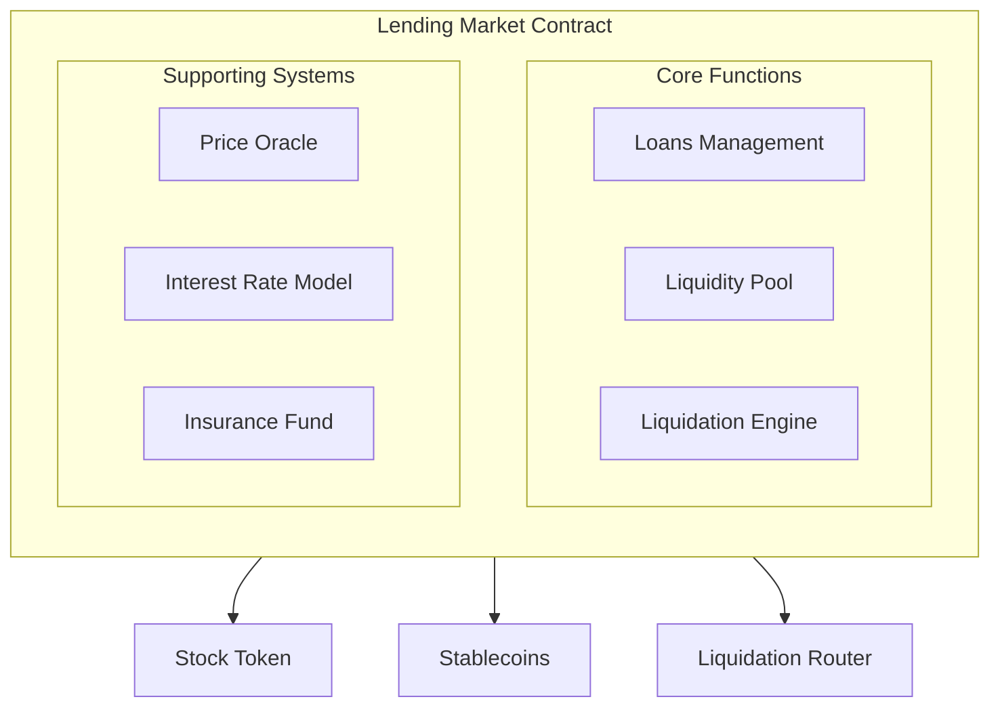
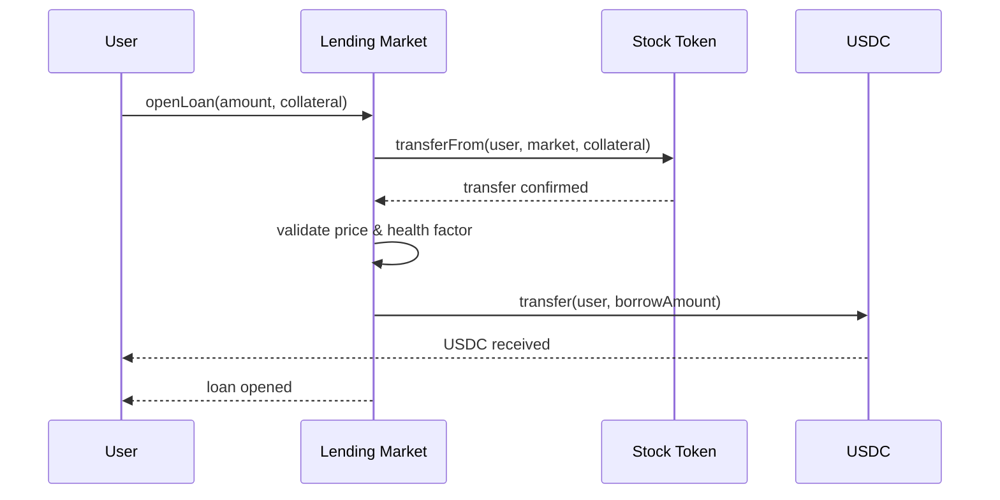
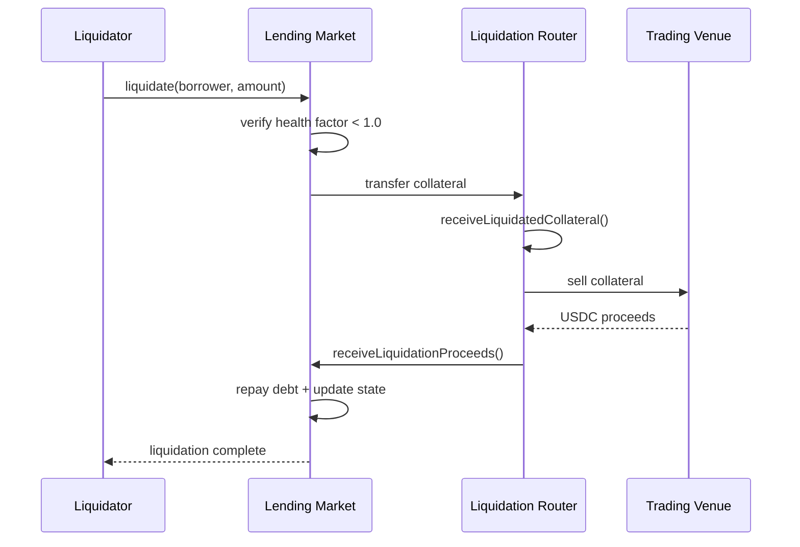

Each lending market deploys as an independent smart contract with upgradeable logic, role-based access control, and configurable risk parameters. Markets operate autonomously once deployed—handling loans, interest, and liquidations without manual intervention.

<Note>
You can use any erc20 token to pair with your tokenized asset, USDC is only used as an example in this documentation.
</Note>

## Architecture Overview

## Core Components

### Lending Market

The main contract handling all lending operations:

| Function | Description |
|----------|-------------|
| `addLiquidity` | Deposit USDC, receive LP shares |
| `removeLiquidity` | Burn shares, withdraw USDC |
| `openLoan` | Deposit collateral, borrow USDC |
| `repay` | Pay back debt, reduce interest |
| `liquidate` | Seize collateral from unhealthy positions |

### Price Oracle

Provides real-time collateral valuations:

- Supports signed price updates (gasless for users)
- Configurable staleness thresholds
- Multiple authorized price signers
- Fallback to external price feeds

### Interest Rate Model

Calculates borrow and supply rates based on utilization:

$$
\text{Borrow Rate} = \text{Base Rate} + \text{Utilization} \times \text{Multiplier}
$$

Above a configurable "kink" (typically 80% utilization), rates increase sharply to encourage repayments.

### Insurance Fund

Absorbs losses from failed liquidations:

- Funded by protocol fees (portion of interest revenue)
- Covers bad debt when liquidation proceeds fall short
- Automatically replenishes during normal operation

### Liquidation Router

Routes liquidated collateral to trading venues for sale:

- Receives seized collateral from markets
- Forwards to configured trading venues
- Returns USDC proceeds to lending pool
- Supports multiple markets through single deployment

## Access Control Roles

<CardGroup cols={3}>
    <Card title="Admin" icon="user-shield">
        **DEFAULT_ADMIN_ROLE**
        
        - Pause/unpause market
        - Configure insurance fund
        - Upgrade contract logic
        - Grant/revoke other roles
    </Card>
    <Card title="Issuer" icon="building-columns">
        **ISSUER_ROLE**
        
        - Update market configuration
        - Set liquidation contract
        - Authorize oracle signers
        - Approve whitelabel access
    </Card>
    <Card title="Liquidator" icon="gavel">
        **LIQUIDATOR_ROLE**
        
        - Trigger liquidations
        - Settle Dutch auctions
        - Handle timeout scenarios
    </Card>
</CardGroup>

<Warning>
Role assignment happens during market deployment. Ensure proper key management—these roles control critical market functions.
</Warning>

## Market Configuration

Markets are highly configurable to match your risk appetite and regulatory requirements:

### Risk Parameters

| Parameter | Description | Typical Range |
|-----------|-------------|---------------|
| Collateral Factor | Maximum LTV for borrowing | 65-80% |
| Liquidation Threshold | LTV triggering liquidation | 80-90% |
| Liquidation Penalty | Bonus for liquidators | 3-10% |
| Close Factor | Max % liquidatable per tx | 25-50% |
| Min Borrow Amount | Minimum loan size | $100+ |

### Supply Caps

Limit exposure at market and user levels:

| Cap Type | Purpose |
|----------|---------|
| Max Total Collateral | Limits total market size |
| Max User Collateral | Prevents concentration risk |

### Auction Settings

For Dutch auction liquidations:

| Setting | Description |
|---------|-------------|
| Auction Duration | Time from start to minimum price |
| Start Premium | Initial price above oracle (e.g., 130%) |
| Minimum Premium | Floor price (e.g., 95% of oracle) |

## Security Model

### Upgradeability

Markets use the UUPS (Universal Upgradeable Proxy Standard) pattern:

- Logic upgrades require Admin role
- Proxy address stays constant
- State preserved across upgrades
- Emergency fixes possible without redeployment

### Reentrancy Protection

All state-changing functions protected against reentrancy attacks. External calls (token transfers, liquidation callbacks) happen after state updates.

### Pausability

Admins can pause markets during emergencies:

- Stops new loans and borrows
- Repayments still allowed (users can exit)
- Liquidations continue (protecting the pool)
- Liquidity withdrawals permitted

### Price Staleness

Oracle prices include timestamp validation:

- Configurable maximum age (default: 24 hours)
- Stale prices block new borrows
- Protects against manipulation using old data

## Contract Interactions

### Opening a Loan

### Liquidation Flow

<CardGroup cols={2}>
    <Card title="Setup Guide" icon="rocket" href="/new/learn/lending/setup">
        Deploy your first lending market
    </Card>
    <Card title="Liquidation Details" icon="gavel" href="/new/learn/lending/liquidation">
        Liquidation modes and external integration
    </Card>
</CardGroup>