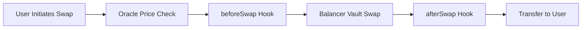

Custom Hooks inject additional logic into the swap execution flow without modifying core pool contracts. The PricingHookV3 intercepts swaps before and after Balancer vault execution, enabling dynamic pricing adjustments, after-hours spreads, and slippage monitoring.

## Hook Execution Flow

Every swap triggers two hook calls: `beforeSwap` runs after oracle validation but before vault execution, and `afterSwap` runs after swap completion with actual output amounts.



Hooks can modify execution parameters, reject swaps by reverting, or record execution data for monitoring. All hook operations execute within the same transaction as the swap itself—either everything succeeds or everything reverts.

## Before Swap Hook

The `beforeSwap` function receives swap details and oracle price, returning adjusted execution price and expected output amount. Use this for after-hours spread application, dynamic fee adjustment, or custom pricing logic.

<CodeGroup>
```solidity Hook Interface
function beforeSwap(
    bytes32 poolId,
    bytes32 assetId,
    address tokenIn,
    uint256 amountIn,
    uint256 oraclePrice
) external returns (
    uint256 executionPrice,
    uint256 expectedOut
);
```

```typescript After-Hours Spread Example
// Hook detects trading outside market hours
if (!isMarketOpen(currentTime)) {
    // Apply 0.5% spread to oracle price
    const spread = oraclePrice * 50n / 10000n;
    const adjustedPrice = oraclePrice + spread;
    
    // Calculate expected output with spread
    const expectedOut = calculateOutput(
        amountIn,
        adjustedPrice,
        poolData
    );
    
    return { executionPrice: adjustedPrice, expectedOut };
}
```
</CodeGroup>

The hook stores execution context including pre-swap price, expected output, and calculated slippage for later validation in `afterSwap`. This enables verification that actual execution matched predicted outcomes.

## After Swap Hook

The `afterSwap` function receives actual output amounts after vault execution, enabling post-execution validation and monitoring. Compare actual outputs against expected amounts to detect excessive slippage or pricing anomalies.

<Accordion title="Slippage Validation Logic">
The hook calculates realized slippage by comparing expected versus actual output:

```typescript
function afterSwap(poolId: string, actualOut: bigint) {
    const context = executionContexts[poolId];
    const expectedOut = context.expectedOut;
    
    // Calculate deviation percentage
    const slippage = expectedOut > actualOut
        ? ((expectedOut - actualOut) * 10000n) / expectedOut
        : ((actualOut - expectedOut) * 10000n) / expectedOut;
    
    // Check against pool-specific or default threshold
    const maxSlippage = poolMaxSlippage[poolId] || defaultMaxSlippage;
    
    if (slippage > maxSlippage) {
        emit SlippageExceeded(poolId, expectedOut, actualOut, slippage);
        // Log for monitoring but don't revert - swap already executed
    }
    
    // Store for analytics
    context.actualOut = actualOut;
    context.slippage = slippage;
}
```

Unlike `beforeSwap`, this function cannot revert the swap since tokens already transferred. Instead, emit events for monitoring systems to detect unusual execution patterns.
</Accordion>

## After-Hours Spreads

Apply additional spreads when trading occurs outside traditional market hours (14:00-21:00 UTC for US markets). This compensates liquidity providers for increased risk when external price discovery mechanisms are inactive.

| Time Period | Market Status | Spread Applied |
|-------------|---------------|----------------|
| 14:00-21:00 UTC, Mon-Fri | Market Open | 0 bps (oracle price) |
| 21:00-14:00 UTC, Mon-Fri | After Hours | 25-100 bps configurable |
| Saturday-Sunday | Weekend | 50-150 bps configurable |
| Exchange Holidays | Closed | 50-150 bps configurable |

Configure spreads through the `setAfterHoursSpread` function with values in basis points. Higher spreads during low-liquidity periods protect providers from adverse selection while maintaining trading availability.

<CodeGroup>
```typescript Set After-Hours Spread
// POST https://api.trusset.org/v1/trading/hooks/configure

await fetch('https://api.trusset.org/v1/trading/hooks/configure', {
  method: 'POST',
  body: JSON.stringify({
    hookAddress: "0xPricingHookV3",
    afterHoursSpreadBps: 50, // 0.5%
    weekendSpreadBps: 100    // 1.0%
  })
});
```

```solidity Market Hours Detection
function _isMarketOpen() private view returns (bool) {
    uint256 hourOfDay = (block.timestamp % 86400) / 3600;
    uint256 dayOfWeek = (block.timestamp / 86400 + 4) % 7;
    
    // Weekend check (0 = Sunday, 6 = Saturday)
    if (dayOfWeek == 0 || dayOfWeek == 6) return false;
    
    // Market hours: 14:00-21:00 UTC
    return hourOfDay >= 14 && hourOfDay < 21;
}
```
</CodeGroup>

## Pool-Specific Configuration

Configure different slippage thresholds and pricing rules per pool to accommodate varying liquidity profiles and volatility characteristics.

<ParamField path="setMaxSlippage" type="function">
  Configure maximum acceptable slippage for specific pool, overriding default threshold
</ParamField>

<ParamField path="setPoolPricingRule" type="function">
  Apply custom pricing logic to individual pools (e.g., different after-hours spreads)
</ParamField>

<ParamField path="disableHookForPool" type="function">
  Exclude specific pools from hook execution, falling back to standard oracle pricing
</ParamField>

Pools with deeper liquidity may use tighter slippage thresholds (25-50 bps) while illiquid pools require wider tolerances (100-200 bps) to prevent excessive failed transactions.

## Execution Context Storage

Hooks maintain execution state in memory between `beforeSwap` and `afterSwap` calls, storing expected outcomes for later comparison.

<ResponseField name="poolId" type="bytes32">
  Pool identifier linking pre-swap and post-swap contexts
</ResponseField>

<ResponseField name="assetId" type="bytes32">
  Asset identifier (ISIN) for price feed lookup
</ResponseField>

<ResponseField name="preSwapPrice" type="uint256">
  Oracle price at execution time, before any spread adjustments
</ResponseField>

<ResponseField name="expectedOut" type="uint256">
  Calculated output amount based on oracle price and pool state
</ResponseField>

<ResponseField name="actualOut" type="uint256">
  Actual received amount after Balancer vault execution
</ResponseField>

<ResponseField name="slippage" type="uint256">
  Calculated deviation between expected and actual output in basis points
</ResponseField>

Context storage enables post-execution analytics and monitoring. Track which pools experience consistent slippage, identify pricing inefficiencies, or detect potential manipulation attempts.

## Custom Hook Development

Deploy your own hooks implementing the `IPricingHookV3` interface for specialized pricing logic. Common use cases include:

- **Dynamic fee adjustment** based on volatility or time of day
- **Circuit breakers** that halt trading during extreme price movements
- **MEV protection** through price impact limits or randomized execution
- **Compliance checks** validating additional rules beyond token-level restrictions
- **Analytics recording** for trade surveillance and market monitoring

<Warning>
Hooks execute within the swap transaction and can consume significant gas. Complex logic or expensive storage operations may cause transactions to fail due to block gas limits. Test thoroughly before production deployment.
</Warning>

Set hooks through the PoolManagerV3 contract using the `setPricingHook` function. This routes through timelock governance to prevent immediate changes that could disrupt active pools.

<CardGroup cols={2}>
    <Card title="Oracle Pricing" icon="chart-line" href="/new/learn/trading/amm/pricing">
        Price feed integration and validation logic
    </Card>
    <Card title="Pool Controllers" icon="sliders" href="/new/learn/trading/amm/controllers">
        Administrative functions for hook configuration
    </Card>
    <Card title="Balancer Pools" icon="scale-balanced" href="/new/learn/trading/amm/balancer-pools">
        Core pool mechanics and swap execution
    </Card>
    <Card title="Hook Contracts" icon="file-contract" href="/contracts/trading/hooks">
        Smart contract implementation details
    </Card>
</CardGroup>
