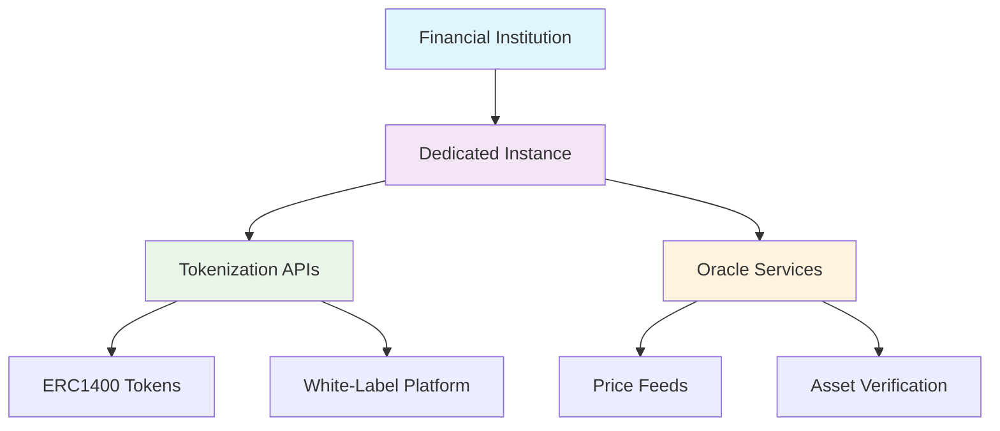
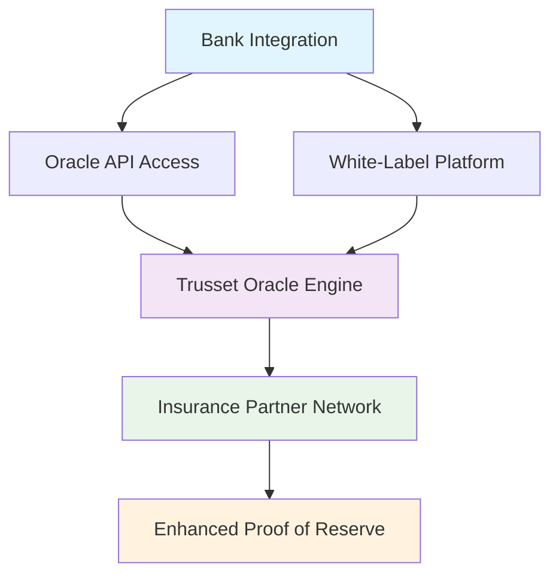

Our protocol provides enterprise-grade tokenization infrastructure designed specifically for financial institutions. The system delivers complete API-based services for asset tokenization and lifecycle management while maintaining regulatory compliance and operational independence.

## Technical Architecture

The Trusset platform operates through the **Issuer Platform**—your institution's central control system for all tokenization operations:

<Steps>
  <Step title="Instance Provisioning">
    Create isolated instances with dedicated environments for testing and production operations.
  </Step>
  
  <Step title="Service Integration">
    Choose and integrate specific services: Tokenization APIs, Oracle feeds, White-label platforms, or complete infrastructure.
  </Step>
  
  <Step title="Compliance Configuration">
    Set regulatory parameters and compliance rules once through our APIs. Smart contracts automatically enforce these requirements.
  </Step>
  
  <Step title="Client Operations">
    Your clients operate independently with their tokenized assets without ongoing dependencies on Trusset infrastructure.
  </Step>
</Steps>

## Platform Structure

The platform operates through two specialized service layers providing complementary functionality:

<Columns cols={2}>
  <Card title="Tokenization Service" icon="coins">
    **Complete Asset Digitization APIs**
    
    ERC1400 token creation, automated KYC/KYB integration, white-label platform deployment, stock exchange APIs, and transaction monitoring infrastructure.
  </Card>
  
  <Card title="Oracle Service" icon="database">
    **Asset Verification Infrastructure**
    
    Real-world asset pricing, automated partner integrations, insurance-backed verification, and enhanced proof of reserve implementation.
  </Card>
</Columns>

## Service Architecture

### Issuer Platform: Central Control System

The Issuer Platform acts as your institution's command center, providing:

- **Instance Management**: Isolated environments with dedicated API keys
- **Service Selection**: Modular integration of tokenization and oracle services  
- **Access Control**: Granular permissions and security settings
- **Monitoring Dashboard**: Real-time analytics and operational metrics

### Instance-Based Isolation

Each institution operates within completely isolated instances, ensuring:
- **Data Separation**: No cross-contamination between institutions
- **Security Isolation**: Dedicated API keys and access controls
- **Operational Independence**: Complete control over your tokenization infrastructure
- **Scalable Architecture**: Add instances and services as your operations grow

## Core Technical Features

### Automated Compliance Processing
- **Smart Contract Rules**: Compliance requirements programmed directly into tokens
- **Automatic Verification**: Real-time eligibility and jurisdictional checks
- **Regulatory Reporting**: Complete audit trails for compliance documentation
- **Zero-Knowledge Proofs**: Privacy-preserving identity verification

### Enterprise Security Model
- **Instance Isolation**: Complete separation between financial institutions
- **API Authentication**: Secure token-based authentication for all endpoints
- **Encrypted Communications**: TLS 1.3 encryption for all API traffic
- **Audit Logging**: Comprehensive logging for security and compliance monitoring

### Modular Integration Architecture
- **API-First Design**: All functionality accessible through REST APIs
- **Service Selection**: Choose and pay only for the services you need
- **Incremental Deployment**: Add services as your digital asset offerings grow
- **Custom Integration**: Flexible APIs support custom institutional workflows

## Oracle Infrastructure

Trusset Verify implements a multi-layered verification system for real-world asset pricing and validation:

<Accordion title="Oracle Architecture Components">
  **Bank Integration**: Two integration paths - direct Oracle API access or embedded verification in white-label platforms.

  **Trusset Oracle Engine**: Machine learning algorithms, business rules, and fallback mechanisms for price discovery and asset verification.

  **Insurance Partner Network**: Direct integrations with insurance companies, professional appraisers, and verification services for reliable data.

  **Enhanced Proof of Reserve**: Custom implementation combining traditional proof of reserve with real-time valuation data from verified sources.
</Accordion>

## Integration Patterns

### API-Only Integration
Perfect for institutions with existing client interfaces:
- Direct API access to all tokenization services
- Custom user experience design and workflows
- Integration into existing banking systems
- Maximum flexibility and control

### White-Label Platform Deployment
Complete client-facing infrastructure:
- 24-hour deployment with your branding
- Full customization of interfaces and functionality
- Zero ongoing technical maintenance
- Configurable access controls and compliance settings

### Hybrid Architecture
Best of both approaches:
- Backend API integration for institutional operations
- White-label platforms for specific client segments
- Custom interfaces for high-value clients
- Unified reporting through Issuer Platform

## Security & Compliance Architecture

<Info>
The protocol ensures complete regulatory compliance through programmable smart contract rules, automated verification systems, and comprehensive audit trails—all while maintaining operational independence for your institution and privacy for your clients.
</Info>

## Enterprise Support Infrastructure

- **Dedicated Technical Teams**: Direct access to integration specialists
- **24/7 System Monitoring**: Continuous infrastructure monitoring and alerts
- **Custom SLA Options**: Service level agreements tailored to institutional requirements
- **Priority Support Channels**: Fast-track issue resolution and feature development

---

<Card title="Ready to Integrate?" icon="rocket" href="https://issuers.trusset.org">
  Contact our enterprise team to discuss your institution's specific tokenization requirements and integration timeline.
</Card>