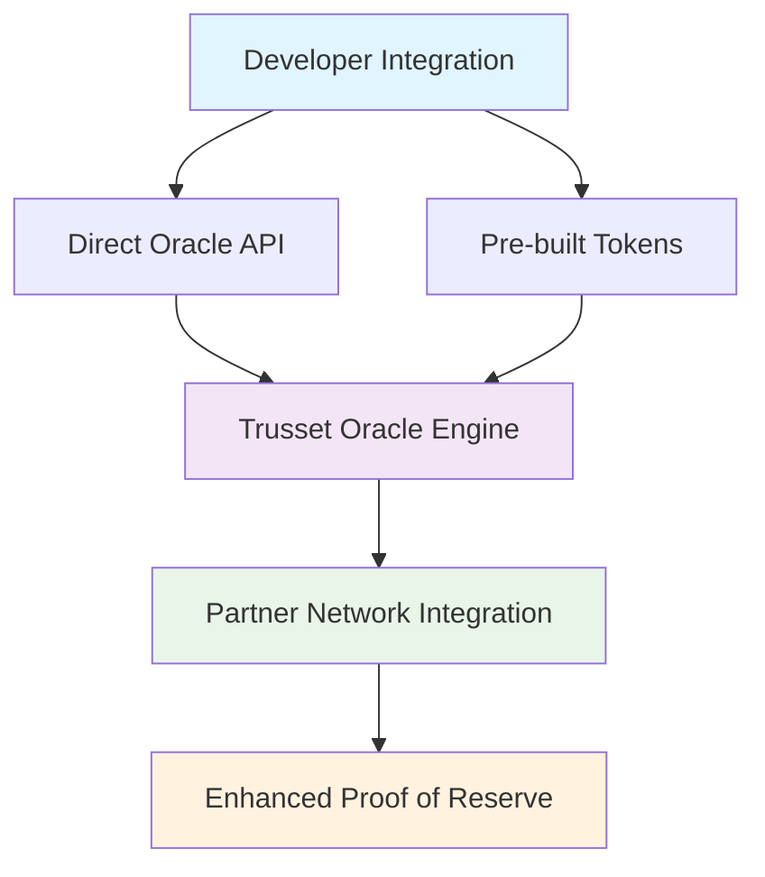

# Protocol Architecture

The Trusset protocol connects users to verified asset issuers through a decentralized network. The system provides complete infrastructure for asset tokenization while maintaining legal compliance and operational independence.

## Technical Workflow

The protocol operates through a four-step verification and issuance process:

<Steps>
  <Step title="Asset Selection & Data Processing">
    Users select assets for tokenization through our platform. Our software automatically sorts data based on legal requirements and provides issuers everything needed to start the legal process with tamper-proof verification data.
  </Step>
  
  <Step title="Issuer Connection">
    The system automatically connects users to verified issuers from our partner network. Issuers can access requests via our dashboard or integrate our services directly through APIs.
  </Step>
  
  <Step title="Verification Pass Issuance">
    Issuers create verification passes containing asset parameters. For identity verification, only cryptographic proof is stored. Verification passes are issued to public keys, enabling automatic and secure approval without additional communication.
  </Step>
  
  <Step title="Independent Token Operations">
    Users mint tokens, manage identity, and operate within the decentralized network without ongoing dependencies on the protocol or issuers.
  </Step>
</Steps>

## Company Structure

The protocol operates through two specialized entities providing complementary services:

<Columns cols={2}>
  <Card title="Trusset" icon="code">
    **Main Technology Platform**
    
    Pure technology provider and SaaS platform. Handles token creation, management, trading through decentralized marketplace, on-chain liquidity solutions, and developer tools.
  </Card>
  
  <Card title="Trusset Verify" icon="shield-check">
    **Verification Infrastructure**
    
    Specialized subsidiary working with asset verifiers and insurance companies. Provides foundation for the first RWA oracle protocol using enhanced proof of reserve.
  </Card>
</Columns>

## Oracle Protocol Architecture

Trusset Verify implements a layered verification system for real-world asset pricing and validation:

<Accordion title="Architecture Layer Details">
  **Developer Integration**: Two integration paths - direct Oracle API access or pre-built token implementations for rapid deployment.

  **Trusset Oracle Engine**: Core ML algorithms, business rules, and fallback mechanisms for price discovery and asset verification.

  **Partner Network Integration**: Direct API integrations with insurance companies, professional appraisers, and verification services.

  **Enhanced Proof of Reserve**: Custom implementation combining traditional proof of reserve with real-time valuation data from verified sources.
</Accordion>

## Technical Features

- **Multi-issuer Network**: Decentralized issuer network eliminates single points of failure
- **Automated Compliance Processing**: Software automatically sorts data based on jurisdictional legal requirements  
- **Zero Protocol Dependencies**: Users operate independently after initial verification
- **Flexible Integration**: Partners integrate through APIs or use provided dashboard interface
- **On-chain Verification**: All verification passes and asset parameters stored immutably on-chain
- **Proof-based Identity**: Cryptographic proofs without storing underlying personal data

## Network Architecture

<Info>
The protocol uses "entrypoints" through verified issuers. Users are never dependent on a single entry point and can choose from our partner network. Partners benefit from new customers, end-to-end software with custom integrations, and zero ongoing operational costs.
</Info>

## Next Steps

<Card title="Become an Issuer" icon="building" href="https://www.trusset.org/contact">
  Ready to integrate Trusset and cut management costs by over 80% and experience no more downtime? Drop us a message, and a team member will connect with you.
</Card>