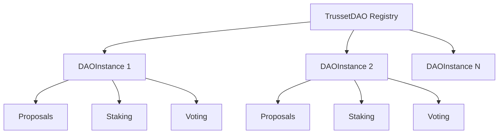

## Overview

The Trusset DAO SDK includes two main smart contracts that work together to provide comprehensive decentralized governance functionality.

<CardGroup cols={2}>
  <Card title="TrussetDAO" icon="building" href="#trussetdao-contract">
    Main registry and proposal management contract
  </Card>
  <Card title="DAOInstance" icon="users" href="#daoinstance-contract">
    Individual DAO implementation with staking and voting
  </Card>
</CardGroup>

## Architecture

The contracts use a factory pattern where TrussetDAO manages multiple DAOInstance contracts:



<Note>
All contracts are written in Solidity ^0.8.19 and optimized for gas efficiency with 200 optimization runs.
</Note>

## TrussetDAO Contract

The main registry contract that manages proposals and coordinates multiple DAO instances.

### Contract Address

<Tabs>
  <Tab title="Sepolia Testnet">
    ```
    0x39cB1a0D5Cb0043A1D922932a9fF13e46135Fa5b
    ```
  </Tab>
  
  <Tab title="Mainnet">
    Deploy using: `trusset-dao deploy --network mainnet`
  </Tab>
</Tabs>

### Key Features

<AccordionGroup>
  <Accordion title="DAO Registration">
    Register new DAO instances with the main registry:
    
    ```solidity
    function registerDAO(
        address dao,
        address token,
        uint256 minStake,
        uint256 proposalFee,
        uint256 minVotes
    ) external
    ```
    
    **Parameters:**
    - `dao` - Address of the DAOInstance contract
    - `token` - ERC-20 token for staking (zero address for ETH)
    - `minStake` - Minimum tokens required to stake
    - `proposalFee` - Fee to submit proposals
    - `minVotes` - Min votes needed for proposal to pass
  </Accordion>
  
  <Accordion title="Proposal Management">
    Central proposal creation and voting:
    
    ```solidity
    function createProposal(
        string memory title,
        string memory description,
        bytes memory data
    ) external returns (uint256)
    ```
    
    ```solidity
    function vote(
        uint256 proposalId,
        bool support,
        uint256 votes
    ) external
    ```
  </Accordion>
  
  <Accordion title="Proposal Execution">
    Execute successful proposals:
    
    ```solidity
    function executeProposal(uint256 proposalId) external
    ```
    
    **Requirements:**
    - Voting period must be ended
    - For votes greater than Against votes  
    - Minimum vote threshold met
    - Not already executed
  </Accordion>
</AccordionGroup>

### Proposal States

<CodeGroup>
```solidity Enum Definition
enum ProposalState {
    Pending,    // Voting not yet started (delay period)
    Active,     // Currently accepting votes
    Succeeded,  // Passed but not executed
    Defeated,   // Failed to pass
    Executed    // Successfully executed
}
```

```javascript State Transitions
// Pending -> Active (after voting delay)
// Active -> Succeeded/Defeated (after voting period)  
// Succeeded -> Executed (manual execution)

const state = await contract.getProposalState(proposalId);
console.log('Current state:', state);
```
</CodeGroup>

### Events

<ResponseField name="DAORegistered" type="event">
  Emitted when a new DAO instance is registered
  ```solidity
  event DAORegistered(
      address indexed dao,
      address indexed token,
      uint256 minStake,
      uint256 proposalFee,
      uint256 minVotes
  );
  ```
</ResponseField>

<ResponseField name="ProposalCreated" type="event">
  Emitted when a new proposal is created
  ```solidity
  event ProposalCreated(
      uint256 indexed proposalId,
      address indexed dao,
      address indexed proposer,
      string title
  );
  ```
</ResponseField>

<ResponseField name="VoteCast" type="event">
  Emitted when a vote is cast on a proposal
  ```solidity
  event VoteCast(
      uint256 indexed proposalId,
      address indexed voter,
      bool support,
      uint256 votes
  );
  ```
</ResponseField>

<ResponseField name="ProposalExecuted" type="event">
  Emitted when a proposal is executed
  ```solidity
  event ProposalExecuted(uint256 indexed proposalId);
  ```
</ResponseField>

### Usage Examples

<CodeGroup>
```javascript Create Proposal
const { ethers } = require('ethers');

// Connect to contract
const contract = new ethers.Contract(
  TRUSSET_DAO_ADDRESS,
  TRUSSET_DAO_ABI,
  signer
);

// Create proposal
const tx = await contract.createProposal(
  "Increase Staking Rewards",
  "Proposal to increase APY from 5% to 7%",
  "0x" // Empty data for text-only proposal
);

const receipt = await tx.wait();
const event = receipt.events.find(e => e.event === 'ProposalCreated');
const proposalId = event.args.proposalId;

console.log('Proposal created with ID:', proposalId.toString());
```

```javascript Vote on Proposal
// Vote for a proposal
const voteTx = await contract.vote(
  proposalId,
  true, // support true means vote for
  ethers.utils.parseEther("100") // voting power
);

await voteTx.wait();
console.log('Vote cast successfully');
```

```javascript Execute Proposal
// Check if proposal can be executed
const state = await contract.getProposalState(proposalId);

if (state === 2) { // Succeeded state
  const executeTx = await contract.executeProposal(proposalId);
  await executeTx.wait();
  console.log('Proposal executed successfully');
}
```
</CodeGroup>

## DAOInstance Contract

Individual DAO implementation that handles staking, member management, and local governance.

### Contract Address

Each DAO has its own instance. Example:
```
0x757948344907d08fF5844c50A91880066C6b4420
```

### Key Features

<AccordionGroup>
  <Accordion title="Token Staking">
    Stake tokens to participate in governance:
    
    ```solidity
    function stake(uint256 amount) external
    ```
    
    **Requirements:**
    - Amount must be greater than or equal to minimum stake
    - User has sufficient token balance
    - Token approval for contract
    
    **Effects:**
    - Increases user's voting power
    - Locks tokens for 24 hours
    - Emits `Staked` event
  </Accordion>
  
  <Accordion title="Token Unstaking">
    Withdraw staked tokens after lock period:
    
    ```solidity
    function unstake(uint256 amount) external
    ```
    
    **Requirements:**
    - 24 hours passed since last stake
    - Amount must be less than or equal to user's staked balance
    - User cannot have active votes
  </Accordion>
  
  <Accordion title="Proposal Submission">
    Submit proposals to the main DAO:
    
    ```solidity
    function createProposal(
        string memory title,
        string memory description,
        bytes memory data
    ) external returns (uint256)
    ```
    
    **Requirements:**
    - User has minimum stake
    - Pay proposal fee (if configured)
    - Title and description provided
  </Accordion>
  
  <Accordion title="Voting">
    Vote on proposals with staked tokens:
    
    ```solidity
    function vote(uint256 proposalId, bool support) external
    ```
    
    **Voting Power:**
    - 1 staked token gives 1 vote
    - Cannot vote twice on same proposal
    - Voting power determined at vote time
  </Accordion>
</AccordionGroup>

### Configuration Management

<Tabs>
  <Tab title="Get Configuration">
    ```solidity
    function getConfig() external view returns (
        uint256 _minStake,
        uint256 _proposalFee,
        uint256 _minVotes,
        uint256 _totalStaked
    )
    ```
  </Tab>
  
  <Tab title="Update Configuration">
    ```solidity
    function updateConfig(
        uint256 _minStake,
        uint256 _proposalFee,
        uint256 _minVotes
    ) external onlyAdmin
    ```
  </Tab>
  
  <Tab title="Admin Transfer">
    ```solidity
    function transferAdmin(address newAdmin) external onlyAdmin
    ```
  </Tab>
</Tabs>

### Staking Mechanics

The staking system includes several safety features:

<Steps>
  <Step title="Stake Tokens">
    Users stake ERC-20 tokens to gain voting power:
    
    ```solidity
    // Transfer tokens to contract
    require(IERC20(token).transferFrom(msg.sender, address(this), amount));
    
    // Update user balance
    stakes[msg.sender] = stakes[msg.sender] + amount;
    totalStaked = totalStaked + amount;
    lastStakeTime[msg.sender] = block.timestamp;
    ```
  </Step>
  
  <Step title="Lock Period">
    24-hour lock prevents immediate unstaking:
    
    ```solidity
    // Check lock period
    require(block.timestamp &gt;= lastStakeTime[msg.sender] + 1 days, "Locked");
    ```
  </Step>
  
  <Step title="Voting Power">
    Staked amount directly translates to voting power:
    
    ```solidity
    // Vote with full stake as voting power
    ITrussetDAO(mainDAO).vote(proposalId, support, stakes[msg.sender]);
    ```
  </Step>
</Steps>

### Events

<ResponseField name="DAOCreated" type="event">
  Emitted when DAO instance is initialized
  ```solidity
  event DAOCreated(
      address indexed admin,
      string name,
      address indexed token
  );
  ```
</ResponseField>

<ResponseField name="Staked" type="event">
  Emitted when user stakes tokens
  ```solidity
  event Staked(address indexed user, uint256 amount);
  ```
</ResponseField>

<ResponseField name="Unstaked" type="event">
  Emitted when user unstakes tokens
  ```solidity
  event Unstaked(address indexed user, uint256 amount);
  ```
</ResponseField>

<ResponseField name="ProposalSubmitted" type="event">
  Emitted when proposal is submitted to main DAO
  ```solidity
  event ProposalSubmitted(
      uint256 indexed proposalId,
      address indexed proposer,
      string title
  );
  ```
</ResponseField>

<ResponseField name="VoteSubmitted" type="event">
  Emitted when user votes on proposal
  ```solidity
  event VoteSubmitted(
      uint256 indexed proposalId,
      address indexed voter,
      bool support,
      uint256 votes
  );
  ```
</ResponseField>

### Usage Examples

<CodeGroup>
```javascript Stake Tokens
// First approve tokens
const tokenContract = new ethers.Contract(TOKEN_ADDRESS, ERC20_ABI, signer);
const stakeAmount = ethers.utils.parseEther("100");

await tokenContract.approve(DAO_INSTANCE_ADDRESS, stakeAmount);

// Then stake
const daoContract = new ethers.Contract(
  DAO_INSTANCE_ADDRESS,
  DAO_INSTANCE_ABI,
  signer
);

const stakeTx = await daoContract.stake(stakeAmount);
await stakeTx.wait();

console.log('Staked 100 tokens successfully');
```

```javascript Check Stake Status
// Get user's stake info
const userStake = await daoContract.getStake(userAddress);
const config = await daoContract.getConfig();

console.log('User stake:', ethers.utils.formatEther(userStake));
console.log('Min stake:', ethers.utils.formatEther(config[0]));
console.log('Total staked:', ethers.utils.formatEther(config[3]));

// Check if can unstake
const lastStakeTime = await daoContract.lastStakeTime(userAddress);
const canUnstake = Date.now() / 1000 &gt; lastStakeTime.toNumber() + 86400;

console.log('Can unstake:', canUnstake);
```

```javascript Submit and Vote
// Submit proposal
const proposalTx = await daoContract.createProposal(
  "Update Reward Rate",
  "Increase staking rewards to 8% APY",
  "0x"
);

const receipt = await proposalTx.wait();
const event = receipt.events.find(e => e.event === 'ProposalSubmitted');
const proposalId = event.args.proposalId;

// Vote on proposal (support = true)
const voteTx = await daoContract.vote(proposalId, true);
await voteTx.wait();

console.log('Voted on proposal', proposalId.toString());
```
</CodeGroup>

## Security Features

### Access Control

<AccordionGroup>
  <Accordion title="Admin Functions">
    Only DAO admin can perform sensitive operations:
    
    ```solidity
    modifier onlyAdmin() {
        require(msg.sender == admin, "Only admin");
        _;
    }
    
    function updateConfig(...) external onlyAdmin { }
    function transferAdmin(...) external onlyAdmin { }
    function emergencyWithdraw() external onlyAdmin { }
    ```
  </Accordion>
  
  <Accordion title="Registration Control">
    Only registered DAOs can create proposals:
    
    ```solidity
    modifier onlyRegisteredDAO() {
        require(instances[msg.sender].active, "Not registered");
        _;
    }
    
    function createProposal(...) external onlyRegisteredDAO { }
    ```
  </Accordion>
  
  <Accordion title="Voting Requirements">
    Strict validation for voting participation:
    
    ```solidity
    // Must have minimum stake
    require(stakes[msg.sender] &gt;= minStake, "Insufficient stake");
    
    // Cannot vote twice
    require(!hasVoted[msg.sender][proposalId], "Already voted");
    
    // Proposal must be active
    require(block.timestamp &gt;= proposal.startTime, "Voting not started");
    require(block.timestamp &lt;= proposal.endTime, "Voting ended");
    ```
  </Accordion>
</AccordionGroup>

### Reentrancy Protection

The contracts use checks-effects-interactions pattern to prevent reentrancy:

```solidity
function unstake(uint256 amount) external {
    // Checks
    require(stakes[msg.sender] &gt;= amount, "Insufficient stake");
    require(block.timestamp &gt;= lastStakeTime[msg.sender] + 1 days, "Locked");
    
    // Effects
    stakes[msg.sender] = stakes[msg.sender] - amount;
    totalStaked = totalStaked - amount;
    
    // Interactions
    require(IERC20(token).transfer(msg.sender, amount), "Transfer failed");
}
```

### Emergency Functions

<Warning>
Emergency functions are only available to admin and should be used cautiously in production.
</Warning>

```solidity
function emergencyWithdraw() external onlyAdmin {
    uint256 balance = IERC20(token).balanceOf(address(this));
    require(IERC20(token).transfer(admin, balance), "Transfer failed");
    
    emit EmergencyWithdraw(admin, balance);
}
```

## Gas Optimization

The contracts are optimized for gas efficiency:

| Operation | Gas Cost (approx) |
|-----------|-------------------|
| Stake tokens | ~45,000 gas |
| Unstake tokens | ~35,000 gas |
| Create proposal | ~85,000 gas |
| Vote on proposal | ~55,000 gas |
| Execute proposal | ~45,000 gas |

<Note>
Gas costs are approximate and depend on network conditions. The contracts use packed structs and efficient storage patterns to minimize costs.
</Note>

## Integration Guide

### Frontend Integration

<CodeGroup>
```typescript Contract Setup
import { ethers } from 'ethers';
import TrussetDAOABI from './abis/TrussetDAO.json';
import DAOInstanceABI from './abis/DAOInstance.json';

// Connect to contracts
export const getTrussetDAOContract = function(signer) {
  return new ethers.Contract(
    TRUSSET_DAO_ADDRESS,
    TrussetDAOABI.abi,
    signer
  );
};

export const getDAOInstanceContract = function(address, signer) {
  return new ethers.Contract(
    address,
    DAOInstanceABI.abi,
    signer
  );
};
```

```typescript Event Listening
// Listen for proposal events
const contract = getTrussetDAOContract(provider);

contract.on('ProposalCreated', (proposalId, dao, proposer, title) => {
  console.log('New proposal:', {
    id: proposalId.toString(),
    dao,
    proposer,
    title
  });
});

// Listen for votes
contract.on('VoteCast', (proposalId, voter, support, votes) => {
  console.log('Vote cast:', {
    proposalId: proposalId.toString(),
    voter,
    support,
    votes: ethers.utils.formatEther(votes)
  });
});
```
</CodeGroup>

### Testing

<Accordion title="Contract Testing">
  ```javascript test/DAO.test.js
  const { expect } = require("chai");
  const { ethers } = require("hardhat");
  
  describe("TrussetDAO", function () {
    let trussetDAO, daoInstance;
    let owner, addr1, addr2;
  
    beforeEach(async function () {
      [owner, addr1, addr2] = await ethers.getSigners();
      
      // Deploy contracts
      const TrussetDAO = await ethers.getContractFactory("TrussetDAO");
      trussetDAO = await TrussetDAO.deploy();
      
      const DAOInstance = await ethers.getContractFactory("DAOInstance");
      daoInstance = await DAOInstance.deploy(
        trussetDAO.address,
        owner.address,
        ethers.constants.AddressZero, // ETH staking
        "Test DAO",
        "Test Description",
        ethers.utils.parseEther("10"),  // minStake
        ethers.utils.parseEther("1"),   // proposalFee
        ethers.utils.parseEther("100")  // minVotes
      );
    });
  
    it("Should create proposal", async function () {
      // Register DAO
      await trussetDAO.registerDAO(
        daoInstance.address,
        ethers.constants.AddressZero,
        ethers.utils.parseEther("10"),
        ethers.utils.parseEther("1"),
        ethers.utils.parseEther("100")
      );
      
      // Create proposal
      await expect(
        daoInstance.createProposal("Test", "Description", "0x")
      ).to.emit(trussetDAO, "ProposalCreated");
    });
  });
  ```
</Accordion>

The smart contracts provide a robust foundation for decentralized governance with comprehensive security features, gas optimization, and flexible configuration options.